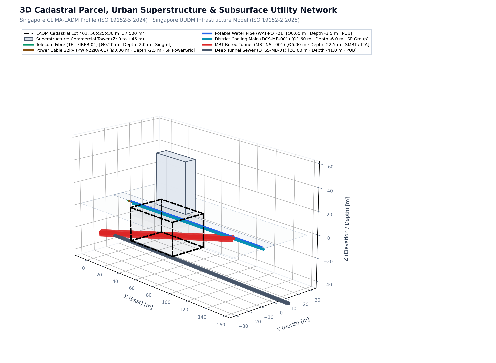

## LADM Climate Adaptation Profile: Spatial Claim Calculation Scripts

First introduced in 2024, the Land Administration Domain Model (LADM) climate adaptation profile integrates subsurface and climate-related data into spatial planning. By abstracting complex 3D Underground Utility Data Models (UUDM) into simplified spatial claims, the profile transforms conventional utility cadastres into actionable, climate-informed spatial constraints. This facilitates the design and exchange of climate-resilient underground spatial plans.

This repository contains the scripts used in the paper:
**"From Geological Models to 3D Utility Cadastres: Advancing the LADM Climate Adaptation Profile for Spatial Planning"** *(Published in the Land Administration Special Edition of the journal Survey Review, 2026).*

**Paper Authors:** Maria Luisa Tarozzo Kawasaki, Peter van Oosterom, and Rob van der Krogt  
**Script Author:** Maria Luisa Tarozzo Kawasaki



---

## Quick Start

**Requirements:** Python 3.9+ (Python 3.10+ recommended)

```bash
# 1. Install dependencies
pip install -r requirements.txt matplotlib

# 2. Generate the baseline sample GLB assets and preview visualization
python generate_sample_assets.py

# 3. Run the Spatial Claim Calculator (built-in demonstration scenarios)
python SpatialClaimCalc.py

# 4. Run with the sample LADM parcel (auto-reads CLIMA-LADM metadata from glTF extras)
python SpatialClaimCalc.py --parcel sample_ladm_parcel.glb

# 5. Run with custom parcel and/or utility database
python SpatialClaimCalc.py --parcel your_parcel.glb --utilities your_utilities.glb

# 6. Calibrate empirical congestion thresholds via Monte Carlo constructability insertion
python calibrateCongestionThresholds.py --runs 5 --resolution 0.5

# 7. Generate standardized multi-strata test scenarios (A, B, C)
python generate_test_scenarios.py

# 8. Render 3D diagnostic figures for all test scenarios
python plotScenarios.py

# 9. Render high-resolution publication-ready 3D visual on clean white background
python plot_uudm_ladm_white.py
```

---

## CLI Reference

### 1. `SpatialClaimCalc.py`

Evaluates 3D spatial congestion by calculating the legal volume occupied by existing utilities (including statutory safety buffers) relative to the 3D volume of the cadastral parcel.

| Argument | Short | Default | Description |
|---|---|---|---|
| `--parcel` | `-p` | *(demo mode)* | Path to parcel file (`.glb`, `.obj`, `.stl`). GLB files are auto-inspected for CLIMA-LADM metadata. |
| `--utilities` | `-u` | `sample_uudm_utilities.glb` | Path to UUDM spatial database (`.glb`). |
| `--buffer` | `-b` | `1.5` | Default legal safety buffer radius in metres (`LA_LegalSpaceUtilityNetworkElement`). |
| `--resolution` | `-r` | `0.25` | Voxel resolution in metres. Lower = higher precision; higher = faster execution. |
| `--sensitivity` | | off | Run resolution sensitivity analysis across 0.10 m, 0.25 m, and 0.50 m. |
| `--verbose` | `-v` | off | Enable detailed debug logging. |

> **Performance note:** The default 0.25 m resolution delivers high spatial fidelity. For rapid testing or large parcels, use `--resolution 0.5` or `--resolution 1.0`.

### 2. `calibrateCongestionThresholds.py`

Derives statistically validated, depth-stratified Space Utilization Index (SUI) thresholds using Monte Carlo constructability insertion stress-testing in an urban right-of-way corridor sandbox.

| Argument | Short | Default | Description |
|---|---|---|---|
| `--runs` | `-n` | `10` | Number of independent Monte Carlo simulation runs (seeds 0 to n-1). |
| `--resolution` | `-r` | `0.25` | Voxel grid resolution in metres. |
| `--stratum` | `-s` | `all` | Stratum to calibrate (`shallow`, `intermediate`, `deep`, or `all`). |
| `--output` | `-o` | `calibrated_thresholds.json` | Path to export calibrated threshold results in JSON. |
| `--probes` | `-k` | `20` | Candidate utility insertion probes per step to compute $P_{\text{insertion}}$. |
| `--verbose` | `-v` | off | Display step-by-step insertion logging. |

---

## Congestion Index Thresholds

### 1. Standard Planning-Policy Thresholds

The general Space Utilization Index (SUI) measures the ratio of statutory occupied utility volume to total parcel volume:

$$\text{SUI} = \frac{V_{\text{Occupied Legal Space}}}{V_{\text{Parcel}}} \times 100\%$$

| Congestion Index | SUI Range | Planning & Constructability Interpretation |
|---|---|---|
| **Low** | $\text{SUI} < 5\%$ | Minimal infrastructure presence; ample routing capacity with negligible conflict risk. |
| **Medium** | $5\% \le \text{SUI} < 20\%$ | Moderate occupation; routing possible but requires coordination and offset routing. |
| **High** | $\text{SUI} \ge 20\%$ | Severe congestion; geometric lock prevents new routing without major deviations or conflict. |

### 2. Empirical Stratified Thresholds (`calibrated_thresholds.json`)

Calibrated via Monte Carlo constructability insertion probability ($P_{\text{insertion}}$), measuring the likelihood that a new standardized utility can traverse an urban utility corridor without conflicting with existing statutory buffers:
- **Low $\to$ Medium transition:** $P_{\text{insertion}} < 0.80$ (80% insertion success)
- **Medium $\to$ High transition:** $P_{\text{insertion}} < 0.20$ (geometric locking threshold)

| Depth Stratum | Depth Range | Candidate Asset | Clearance Buffer | Low $\to$ Medium | Medium $\to$ High |
|---|---|---|---|---|---|
| **Shallow Utilities** | $-1.5\text{ m to } -3.0\text{ m}$ | $\varnothing 0.3\text{ m}$ (Telecom / Power) | $0.3\text{ m}$ | $\sim 14.4\%$ | $\sim 23.2\%$ |
| **Intermediate Utilities** | $-3.0\text{ m to } -7.0\text{ m}$ | $\varnothing 1.0\text{ m}$ (District Cooling / Potable Water) | $0.5\text{ m}$ | $\sim 13.6\%$ | $\sim 27.7\%$ |
| **Deep Infrastructure** | $-7.0\text{ m to } -30.0\text{ m}$ | $\varnothing 6.5\text{ m}$ (MRT / DTSS Tunnels) | $6.0\text{ m}$ | $\sim 33.4\%$ | $\sim 33.4\%$ |

---

## Repository Contents

* **`SpatialClaimCalc.py`** — 3D Spatial Claim Calculator (Python): Primary analysis engine that calculates volumetric legal space occupation, depth-stratified utilization, and assigns LADM `ExtSpatialClaim` congestion indices.
* **`calibrateCongestionThresholds.py`** — Empirical Threshold Calibration (Python): Simulates constructability insertion percolation across right-of-way corridor sandboxes to empirically derive Low/Medium/High thresholds per depth layer. Supersedes legacy heuristic simulators (`congestionSimulator.py`, `SyntheticSGUtilities.py`).
* **`calibrated_thresholds.json`** — Calibrated Threshold Database (JSON): Empirical thresholds, IQR, 95% confidence intervals, and per-run results generated by `calibrateCongestionThresholds.py`.
* **`generate_sample_assets.py`** — Sample Asset Generator (Python): Builds `sample_uudm_utilities.glb` and `sample_ladm_parcel.glb` with full Singapore UUDM (ISO 19152-2:2025) and CLIMA-LADM (ISO 19152-5:2024) metadata.
* **`generate_test_scenarios.py`** — Standardized Scenario Generator (Python): Synthesizes targeted test parcels and utility networks for Scenarios A, B, and C with validated glTF node metadata.
* **`plotScenarios.py`** — Scenario Diagnostic Visualizer (Python): Generates multi-layer 3D plots showing shallow, intermediate, and deep layer congestion metrics.
* **`plot_uudm_ladm_white.py`** — Publication Visualizer (Python): Renders clean, high-resolution figures on a white background for publication and reports (`sample_uudm_ladm_white.png`).
* **`cesium_sandcastle_snippet.js`** — 3D WebGL Visualization (JavaScript): Cesium Sandcastle script for interactive 3D web rendering of UUDM utilities, buildings, and underground cadastral boundaries.
* **`test_spatial_claim_calc.py`** — Unit Test Suite (Python/pytest): Automated test coverage for volume calculations, schema compliance, buffer dilation, and boundary cases.

---

## Sample Assets & Standardized Testbeds

### Baseline Sample Assets

| Asset File | Format | Description |
|---|---|---|
| **`sample_uudm_utilities.glb`** | glTF/GLB | 6 standardized underground utility assets (DCS, MRT, PWR, TEL, WAT, DTSS) with Singapore UUDM metadata in node extras. |
| **`sample_ladm_parcel.glb`** | glTF/GLB | $50 \times 30 \times 25\text{ m}$ 3D cadastral parcel with ISO 19152-5:2024 CLIMA-LADM attributes (`parcelId`, `climaAdaptation_profile`, `referenceFrame`, `verticalDatum`). |
| **`sample_geometry_preview.png`** | PNG | Overview 3D visualization showing utility network, parcel boundary, and architectural superstructure. |
| **`sample_uudm_ladm_white.png`** | PNG | High-contrast publication-grade 3D visualization on white background. |

### Standardized Evaluation Scenarios

Targeted test scenarios generated by `generate_test_scenarios.py` and visualized with `plotScenarios.py`:

| Scenario | Parcel Asset | Utilities Asset | Diagnostic Figure | Description |
|---|---|---|---|---|
| **Scenario A** | `parcel_scenario_A.glb` | `utils_scenario_A.glb` | `Scenario_A_Shallow_High.png` | **Shallow Trench Congestion**: Dense bundle of shallow cables & pipes (Telecom, Power, Water). High shallow SUI, low deep SUI. |
| **Scenario B** | `parcel_scenario_B.glb` | `utils_scenario_B.glb` | `Scenario_B_Intermediate_High.png` | **Intermediate Layer Congestion**: Major District Cooling supply mains causing localized intermediate-layer congestion. |
| **Scenario C** | `parcel_scenario_C.glb` | `utils_scenario_C.glb` | `Scenario_C_Deep_High.png` | **Deep Infrastructure Easement**: MRT transit tunnels and deep sewer tunnels with extensive statutory protection zones. |
| **Scenario D** | Baseline Parcel | Baseline Utilities | `Scenario_D_Balanced_Medium.png` | **Multi-Strata Balanced Network**: Distributed municipal utility arrangement across shallow, intermediate, and deep zones. |

---

## Running the Unit Tests

```bash
pytest test_spatial_claim_calc.py -v
```

All 8 core test suites validate:
- Zero-congestion calculation on empty parcels
- Geometric volume convergence against analytical cylinders
- High-congestion volumetric saturation
- LADM `ExtSpatialClaim` JSON output schema compliance
- Consistency between SUI ratio and percentage representations
- Validation and error handling for invalid/empty parcel meshes
- Voxel resolution sensitivity and stability
- Strict upper-bound constraint ($V_{\text{occupied}} \le V_{\text{parcel}}$)
